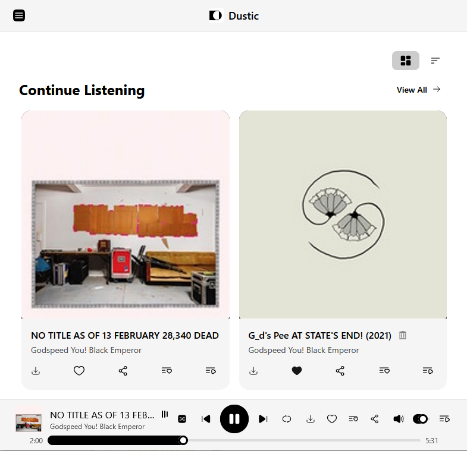

# Dustic

*Audio discovery of the weird, the wonderful, and the forgotten.*

Dustic is a free, open-source music player that streams audio from the [Internet Archive](https://archive.org/) and the [FunkWhale](https://funkwhale.audio/) network, keeping your audio profile yours, without online account, ads, or tracking.

**[Try it now on dustic.app](https://dustic.app)**

Dustic allows browsing millions of recordings: open music, rare vinyl rips, live bootlegs, field recordings, forgotten albums, audiobooks, podcasts. Everything plays in your browser or as a pinned app on your phone.

## Listen

Here are a few curated entry points to get a feel for what Dustic sounds like.

- [Post-rock intro](https://dustic.app/curated/post-rock-intro) — Mogwai, GY!BE, Mono and friends
- [Dustic Magazine](https://dustic.bearblog.dev/) — a monthly zine exploring the archive's hidden corners

## Why Dustic?

- **No account required.** Open the app. Search. Press play.
- **Offline playback.** Download tracks to keep listening without a connection.
- **Your data stays yours.** No cloud profile; export/import your library as a JSON file, or sync across devices with WebDAV.
- **Installable.** Works as a progressive web app on mobile and desktop.
- **Rule-based autoplay.** Set up smart queue rules to keep the music flowing.

## For developers

Dustic is built with SvelteKit, TypeScript, TailwindCSS + DaisyUI, and deploys as a static site (no backend).

### Local setup

```bash
git clone https://github.com/essicolo/dustic.git
cd dustic
npm install
npm run dev
# → http://localhost:5173
```

### Commands

| Command | Description |
|---|---|
| `npm run dev` | Development server |
| `npm run build` | Production build |
| `npm run preview` | Preview production build |
| `npm run check` | TypeScript and Svelte checks |
| `npm test` | Run unit tests |
| `npm run test:watch` | Tests in watch mode |
| `npm run test:ui` | Tests with browser UI |

See `src/tests/README.md` for testing documentation.

### Deployment

Dustic is designed for GitHub Pages. A GitHub Actions workflow handles automatic deployment on push to `main`.

<details>
<summary>Manual deployment & custom domain setup</summary>

#### Manual deployment

```bash
BASE_PATH='/dustic' npm run build
npm install -D gh-pages
npx gh-pages -d build
```

#### Custom domain

1. Add `CNAME` to `static/`:
```bash
echo "dustic.app" > static/CNAME
```

2. Point DNS A records to GitHub Pages IPs (`185.199.108.153`, `185.199.109.153`, `185.199.110.153`, `185.199.111.153`) or add a CNAME to `yourusername.github.io`.

3. Enable HTTPS in Settings → Pages.

#### SPA routing

The build produces identical `index.html` and `404.html` files. GitHub Pages serves `404.html` for unknown routes, and client-side routing takes over from there.

</details>

### User data

Dustic stores nothing server-side. Favorites, playlists, history and settings live in-browser and can be exported/imported as JSON. WebDAV sync is available for cross-device use.

### Internet Archive API

Search requests go directly from the user's browser to the Internet Archive's public API. No server-side proxying — each user has their own rate limit quota.

## Contributing

Contributions welcome. Please [open an issue](https://github.com/essicolo/dustic/issues) first to discuss proposed changes.

## License

GPL-3.0
